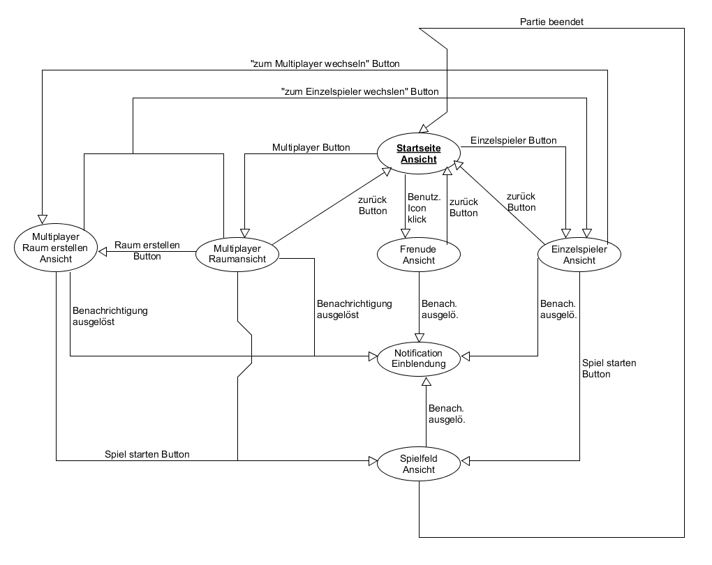

# 1 Anforderungsanalyse
Durak ist ein russisches Kartenspiel welches mit mehreren Personen gespielt wird. Ziel der Applikation ist es, als Unterhaltungsmedium zu fungieren und den Anwender somit zu begeistern. Es soll das Spielen gegen KI gesteuerte Gegner, sowie auch realen menschlichen Gegnern per Internetverbindung ermöglichen.
## 1.1	Musskriterien
*	Portabel auf allen Betriebssystemen für Desktopsysteme (Laptops, Computer)
*	Spielbar gegen Computer Gegner
*	Spielbar gegen Menschliche Gegner
*	Updatesystem implementiert
*	Die Applikation folgt den klassischen Spielregeln von Durak
*	Es ist möglich einen Server zu hosten
*	Es ist möglich einem Server als Client beizutreten

## 1.2	Wunschkriterien
*	Spielerkontosystem implementiert
*	Kontospieler können anderen Kontospieler folgen und werden so benachrichtigt sofern der jeweils andere eine Partie spielt
*	Tonausgabe (Effekte und Musik)
*	Weitere bekannte Regelvariationen Implementieren
*	Per Ad-hoc Verbindung Multiplayer ermöglichen

## 1.3	Abgrenzungskriterien
*	Die Applikation wird nicht für mobile Geräte (Smartphones) verfügbar sein

# 2	Produkteinsatz
## 2.1	Anwendungsbereiche
Da es sich hierbei um ein Unterhaltungsmedium handelt, ist der Anwendungsbereich im privaten Raum vorgesehen.

## 2.2	Zielgruppen
Die Zielgruppe definiert sich durch, Personen welche an Kartenspielen, oder dem Durak Kartenspiel selbst, interessiert sind und im simplen Umgang mit Computer/Laptops vertraut sind.  

## 2.3	Betriebsbedingungen
Da das Electron Framework verwendet wird und es sich hierbei um eine webbasierte Anwendung handelt, ist die Applikation weitestgehend Plattformunabhängig. Sie setzt nur die Ausführung von Google Chromium voraus, welche an die folgenden Bedingungen geknüpft ist:

*	Software:
  * Mind. Windows 7 (keine ARM Versionen)
  * Mind. OS X 10.9. (nur 64 Bit)
  * Mind. Ubuntu 12.04
  * Mind. Fedora 21
  * Mind. Debian 8

* Hardware:
  * Windows – Intel Pentium 4 und 512 MB RAM
  * Mac – 64 Bit Intel Prozessor
  * Linux – Intel Pentium 4 Prozessor

# 3 User Stories
  * Ich möchte als Benutzer eine Partie gegen Computer Gegner spielen, so dass ich zu jederzeit eine Runde spielen kann, auch wenn kein Menschlicher Spieler verfügbar ist
  * Ich möchte als Benutzer eine online Übersicht an verfügbaren Servern einsehen können, so dass ich ggf. mit Freunden spielen kann
  * Ich möchte als Benutzer einem befreundetem Benutzer folgen können, sodass ich benachritigt werde sobald er online ist
  * Ich als Benutzer möchte einen Raum erstellen, so dass ich andere Leute einladen kann
  * Ich als Benutzer möchte zwischen Einzelspieler und Multiplayer wechseln können, so dass ich in einem anderen Modus spielen kann.
  * Ich als Benuter möchte informiert werden sobald ich eine Einladung zu einer Partie erhalten habe, so dass ich darauf regieren kann.
  * Ich als Benutzer möchte während des Spieles mit anderen Mitspielern chatten, so dass man etwas mitteilen kann
  * Ich als Benutzer möchte nach Räumen suchen, so dass ich den richtigen Raum finde.
  * Ich als Benutzer möchte nach Leuten suchen, so dass ich meine Freunde finde.
  * Ich als Benutzer möchte mich registrieren können, so dass ich im System gefunden werden kann.
  * Ich als Benutzer möchte jede Person zu einer Partie einladen, so dass wir gegeneinander spielen können.
  * Ich als Benutzer möchte einen privaten Raum erstellen können, so dass ich nur mit meinen eingeladen Leuten spielen kann.
  * Ich als Benutzer möchte unbekannte Leute einladen können, so dass ich diese Einladen kann, dass es Freunde seien können die nicht im System sind.
  * Ich als Benuter möchte das aktuelle Spiel in den Vollbildmodus wechseln können, so dass ich eine bessere Übersicht vom aktuellen Spiel habe
  * Ich als Benutzer möchte Einzelspiele neustarten können, so dass ich das Spiel nicht zu Ende spielen muss
  * Ich als Benutzer möchte die Anwendung im Hintergrund laufen lassen, so dass ich benachrichtig werde, sobald mich jemand zu einer Partie einlädt.

# 4 Mockups
## Startseite

## Einzelspieler

## Multiplayer Räume

## Multiplayer Raum erstellen

## Spielfeld

## Freunde

## Notification

# 4 Navigation
## Navigation

*Fett- und unterstrichen- markierte Blase = Einstiegspunkt

# 5 Use-Case-Diagramme

## Gesamtsystem

## Einzelspielerkonfiguration

## Kontoverwaltung

## Spielsystem

## Chatsystem

## Mehrspielerkonfiguration

## Raumerstellung

