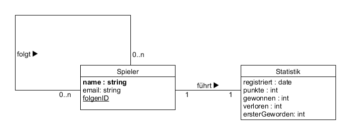

# Vorwort

Wir haben uns für SQLite entschieden. Hierdurch ist eine hohe Kompatibilität gegenüber diverser Betriebssysteme gegeben, da kein extra Treiber zur Verwendung der Datenbank benötigt wird, wie es bei MongoDB zum Beispiel der Fall ist.

Wir werden einen kleinen Server bereitstellen, welcher nur zur Verwaltung der minimalen Datenbank dient. Den Clients wird es ermöglicht per REST mit dem Datenbankserver zu kommunizieren.

### ER-Diagramm:

