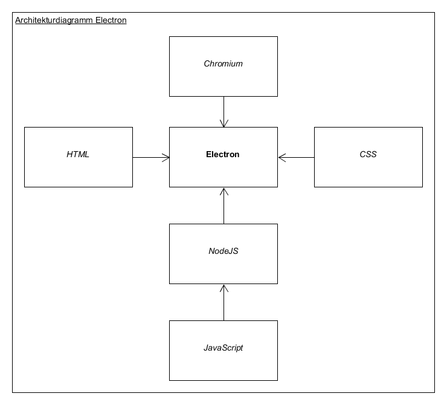

## 1 Electron

#### 1.1 Was ist Electron
Electron ist ein auf Node.js basierendes Open-Source-Framework. Es dient der Entwicklung von grafischen Desktop-Applikationen und ist weitestgehend plattformunabhängig.
#### 1.2 Geschichtliche Entwicklung
Electron hieß früher "Atom Shell" und wurde von GitHub entwickelt.
#### 1.3 Wofür es verwendet wird
Plattformunabhängige Softwarekonzepte mit Augenmerk auf hochwertige Benutzeroberflächengestaltung, finden mit Electron eine passende Schnittstelle zur Umsetzung eines solchen Softwareprojekts.

Renommierte Anwendungen wie "Atom - von Github", "Visual Studio Code - von Microsoft" und "Wordpress - von WordPress Foundation" basieren genau aus diesen Gründen auf dem Electron Framework.
#### 1.4 Auf welchen Technologien es basiert
Electron ist in den Programmiersprachen C++ und JavaScript geschrieben. Es besteht aus den folgenden plattformunabhängigen Komponenten: HTML/CSS, JavaScript/Node.js und Google Chromium
###### 1.4.1 Architekturdiagramm

###### 1.4.2 HTML und CSS
HTML und CSS ermöglichen die präzise, strukturelle und visuelle Definition zum Erscheinungsbild der Applikationen.
###### 1.4.3 JavaScript und NodeJS
Erlauben die Implementierung der Programmlogik und bietet dank dem Node.js Framework eine riesen Bibliothek an bereits fertigen und nützlichen Funktionen.

Des weiteren ist es natürlich auch möglich mit objektorientierten TypeScript Sprachkonzept zu arbeiten, sofern der TypeScript Quellcode letztendlich in JavaScript (eher funktionale Programmierung) umkompilliert wird.
###### 1.4.4 Google Chromium
Ist ein plattformunabhängiger Open-Source-Webbrowser, welcher große Teile seines Quellcodes aus dem Google-Chrome- Webbrowser hat.

Er interpretiert die HTML/CSS und JavaScript/NodeJS Anweisungen der Applikation und gibt diese Ergebnisse an den Anwender aus.

Im Normalfall merkt der Anwender nicht, dass er im prinzip nur einen lokalen offline Chromium-Browser benutzt, da optisch nichts darauf hinweist, wie z.B. eine Adressleiste oder Lesezeichen und so alles wie eine eigene Applikation wirkt.
#### 1.5 Anwendungsgebiete
Da die Anwendungsgebiete wirklich sehr breit gefächert sind, beschränken wir uns in der folgenden Auflistung nur auf ein paar interessante Applikation von +244.
###### 1.5.1 Spiele - 5EClient
Mitglieder des chinesischen "Counter-Strike Global Offensive" Ligaforums 5eplay.com, ist es mit dem 5EClient möglich neuste Spielpartien anzusehen und sich mit anderen Community Mitgliedern auszutauschen.
###### 1.5.2 Editoren - Atom
Ist ein freier und beliebter Texteditor, welcher viele Programmiersprachen im Highlighting unterstützt.
###### 1.5.3 Community Clients - caprine
Ist ein inoffizieller Facebook-Chat-Client.
###### 1.5.4 Hardwarelösungen - Airtame
Anwendern ist es mit einem speziellen HDMI-Wireless-Stick möglich ihren Bildschirminhalt kabellos zu teilen. Dazu wird der Stick in den Grafikkartenausgang des Hosts gesteckt. Nun ist es jedem Benutzer der Airtame Applikation (basiert auf Electron) möglich den Bildschirm des Hosts zu streamen.
###### 1.5.5 Softwareenticklung - Amium
Dient der Dateiverwaltung bei Projekten in größeren Gruppen. Es ermöglicht zum Beispiel mehreren Personen gleichzeitig die Bearbeitung an einer einzigen Worddatei.
###### 1.5.6 Sicherheit - BitCrypt
BitCrypt erlaubt die Verschlüsselung und Entschlüsselung von Datein.
###### 1.5.7 Webbrowser - brave
Ein kostenloser und performanter Webbrowser, welcher sich absolute Anonymisierung als Priorität gesetzt hat.
#### 1.6 Vorraussetzungen zur Ausführung
OS X: ab 10.9

Windows: ab Windows 7

Linux: Ubuntu ab 12.04, Fedora ab 21 und Debian ab 8
#### 1.7 Tools und Libaries zur Entwicklung

Um ein Programm mit Electron zu schreiben kann ein beliebige Entwicklungsumgebung verwendet werden.
Von Vorteil sind jedoch IDE's, die Node.js unterstützen, da Electron auf diese Technologie aufbaut.

Sollte Node.js bereits installiert sein, reicht es aus das Electron Package mit dem `npm` Package Manager runterzuladen.
```
npm install electron
```

#### 1.8 Installation Electron

##### 1.8.1 Struktur
Die Allgemeine Stuktur eines Projeks sieht wie folg aus

```
AppName/
├── package.json
├── main.js
└── index.html
```

##### 1.8.2 package.json
Das Format für die `package.json` ist die gleiche wie bei Node.js.
Eine Beispiel könnte so aussehen.

```json
{
  "name": "electron-quick-start",
  "version": "1.0.0",
  "description": "A minimal Electron application",
  "main": "main.js",
  "scripts": {
    "start": "electron ."
  },
  "repository": "https://github.com/electron/electron-quick-start",
  "keywords": [
    "Electron",
  ],
  "author": "GitHub",
  "license": "CC0-1.0",
  "devDependencies": {
    "electron": "^1.4.1"
  }
}
```
Quelle: https://github.com/electron/electron-quick-start

Die Zeilen `name`, `version` und `description` beschreiben unser Projekt.

Bei `main` hinterlegen wir welches Script unsere Ausgangsdatei ist. Wenn das `main` Feld nicht hinnterlegt ist versucht Electron automatisch `index.js` zu laden.

Mit `start`geben wir an, welcher Kommandobefehl aufgerufen sind, wenn wir unser Projekt mit `npm start` deployen.

Dann haben wir noch die Möglichkeit informationen über die Entwicklung zu hinterlegen, hier können wir angeben, wer am Projekt beteiligt ist, unter welcher Lizenz die Software verwendet wird.

Anschließen geben wir noch mit `dependencies` oder `devDependencies` an, welche Abhängikeiten unser Projekt hat.
Hier wird mit `dev` unterschieden ob es sich nur für die Entwicklungszwecke handelden Abhängikeiten sind oder um Produktionsszwecke.

##### 1.8.2 main.js
Die `main.js` sollte unser Fenster erstellen und Systemevents behandeln. Die Genaure Beschreibung der einzelnen Codeabschnitten sind im Beispiel als Kommentar hinterlegt.

 ``` javascript
 const electron = require('electron')
// Modul für die Kontrolle der Applikation
 const app = electron.app
 // Modul um ein natives Fenster zu erstellen
 const BrowserWindow = electron.BrowserWindow

 const path = require('path')
 const url = require('url')

  // Globale Referenze für das Fenster Objekt
  // Wird automatisch geschlossen, wenn JavaScript das Objekt "garbage collected"
 let mainWindow

 function createWindow () {

   // Erstellt das Browserfenster
   mainWindow = new BrowserWindow({width: 800, height: 600})

   // Wir laden die index.html der Applikation
   mainWindow.loadURL(url.format({
     pathname: path.join(__dirname, 'index.html'),
     protocol: 'file:',
     slashes: true
   }))

   // Öffnet die Konsole fürs Debugen
   mainWindow.webContents.openDevTools()

   // Wird benachrichtigt, wenn das Fenster geschlossen wird
   mainWindow.on('closed', function () {
     // Derefenzierung des Fenster Objekts
     mainWindow = null
   })
 }

 // Diese Methode wird aufgerufen wenn Electron fertig geladen hat und bereit ist das Fenster zu laden
 app.on('ready', createWindow)

 // Benachrichtigung wenn alle Fenster geschlossen sind
 app.on('window-all-closed', function () {
   if (process.platform !== 'darwin') {
     app.quit()
   }
 })

 app.on('activate', function () {.
//In OS X ist es üblich Fenster zu erstellen wenn ein Dock Item angeklickt wurde und keine weiteren Fenster existieren.
   if (mainWindow === null) {
     createWindow()
   }
 })
 ```
 Quelle: https://github.com/electron/electron-quick-start

##### 1.8.3 index.html
Schlussendlich brauchen wir noch unsere `index.html`. Die schreiben wir in ganz normalem Html.
Script Elmente können wie bei Node.js üblich direkt in die Datei, mit `require` eingebunden werden.


```html
<!DOCTYPE html>
<html>
  <head>
    <meta charset="UTF-8">
    <title>Hello World!</title>
  </head>
  <body>
    <h1>Hello World!</h1>
    We are using node <script>document.write(process.versions.node)</script>,
    Chrome <script>document.write(process.versions.chrome)</script>,
    and Electron <script>document.write(process.versions.electron)</script>.
  </body>
</html>
```

##### 1.8.4 Electron starten
Da wir nun alle nötigen Vorraussetzungen für unser Electron Projekt erfüllt haben, können wir unser Projekt über unser Arbeitsverzeichnis mit `npm start` starten.
Falls unsere Abhängikeiten nicht installiert sind müssen wir diese vorher mit dem Befehl `npm install` installieren.

Am besten führen wir beim ersten starten folgenden Befehl aus.
```
npm install && npm start
```

##### 1.8.5 Electron Packager
Mit dem Package `electron-packager` haben wir die Möglichkeit für unterschiedliche Betriebssysteme Bundles unseres Election Projekts erstellen.
Dadurch können die Endnutzer das Projekt direkt über eine Auführbare Datei starten.

###### 1.8.5.1 Betriebssysteme
`electron-packager` erstellet für die folgenden Betriebssysteme ausführbare Dateien.
* Windows (32/64 bit)
* OS X
* Linux (x86/x86_64)

###### 1.8.5.2 Installieren
`electron-packer` können wir mit
```
npm install electron-packager --save-dev
```
installieren

###### 1.8.5.3 Auführen
```
electron-packager <sourcedir> <appname> [options...]
```
| Arugment  | Funktion  |
|---|---|
| sourcedir | Das Hauptverzeichnis unserer Applikation  |
| appname | Appname |
| --platform | gibt an für welche Betriebssysteme ausführbare Dateien erstellt werden sollen |
| --arch | Welche Architekure verwendet werden soll x32 oder x64 |
| --all | gleichgesetzt mit  --platform=all --arch=all|
| --out |  gibt an in welchen Ordner die Dateien hinterlegt werden sollen |

Um für alle Betriebssysteme eine auführbare Datei zu erstellen können wir den den folgenden Befehlt benutzen
```
electron-packager . --all
```
Dies generiert uns alle Dateien im aktuellen Arbeitsverzeichnis
```
App
├── App AppName-darwin-x64
│   ├── App AppName.app
│   │   └── [Mac App Inhalt]
│   ├── LICENSE
│   └── version
├── [ weitere Bundles, wie "App AppName-win32-x64"]
├── package.json
├── index.html
└── main.js
```

#### 1.9 API
###### 1.9.1 Main Prozess
In Electron, wird der Prozess, der die `package.json` ausführt und somit auch die `main.js` Main Prozess genannt. Das Script, dass im Main Prozess läuft, zeigt eine GUI mit hilfe von den erstellten Webseiten an.

###### 1.9.2 Renderer Prozess
Um die erstellen Seiten darzustellen, greift Electron auf Chromium und seine Multi-Prozess Architecture zu.
Jede Seite läuft in einem eigenen Prozess, welches auch als Renderer Prozess bezeichnet wird.

Normalerweise wird Browsers verwehrt auf Native Resourcen zuzugreifen. Mit Electron jedoch, haben wir mit der Hilfe von Node.js Api die mögichkeit mit diesen Nativen Resourcen zu interagieren.

###### 1.9.3 Beide Prozesse
Der Hauptprozess erstellt eine Seite mit Hilfe von einer `BrowserWindow`Instanz. Jede `BrowserWindow` Instanz läuft in Ihrem eigenen Render Prozess. Wenn eine Instanz zersört wurde, dann wird der zuständie Render Prozess ebenfalls zerstört.

Der Hauptprozess verwaltet alle Seiten und deren zuständien Renderer Prozesse. Jeder Render Prozess ist für sich isoliert und kümmert sich nur um eine Seite.

Wenn eine Seite über die GUI auf Native Elemente zugreifen will, dann wird es nicht direkt über die Seite gemacht, das wäre zu gefährlich und könnte zu Lecks führen. Daher muss der Render Prozess einer Seite erst mit dem Hauptprozess kommunizieren um die Nativen Operationen ausführen zu können.

In Electron haben wir mehrere Wege um eine Kommunikation zwischen Render Prozess und dem Hauptprozess erzustellen.
Z. B. `ipcRenderer`und `ipcMain` um Asynchron/synchron zwischen Render Prozess und dem Hauptprozess zu kommunizeren.

###### 1.9.3.1 ipcMain
Das `ipcMain` Module ist eine Instanz der `EventEmitter` Klasse. Die ist dafür zuständig, asynchrone sowie synchrone Nachrichten vom zu empfangen, diese wenn nötig zu bearbeiten und den Renderprozess zu informieren.

```javascript
const {ipcMain} = require('electron')
ipcMain.on('asynchronous-message', (event, arg) => {
  console.log(arg)
  event.sender.send('asynchronous-reply', 'pong')
})

ipcMain.on('synchronous-message', (event, arg) => {
  console.log(arg)
  event.returnValue = 'pong'
})
```

###### 1.9.3.2 ipcRenderer
Das `ipcRenderer` Modul ist wie `ipcMain` eine Instanze der `EventEmitter` Klasse. Mit diesem Modul können wir Nachrichten an den `ipcMain` verschicken, und Nachrichten vom `ipcMain` empfangen.

```javascript
const {ipcRenderer} = require('electron')
console.log(ipcRenderer.sendSync('synchronous-message', 'ping'))

ipcRenderer.on('asynchronous-reply', (event, arg) => {
  console.log(arg)
})
ipcRenderer.send('asynchronous-message', 'ping')
```


## 2 SQLite
#### 1.1 Was ist SQLite
Mit SQLite ist man in der Lage eine kleine relationale Datenbank lokal und Server/Client unabhängig zu verwalten. Sie unterstützt einen Großteil der im SQL-92-Standard festgelegten SQL-Sprachbefehle und ist somit weitestgehend mit MSSQL- und MySQL-Skripten kompatibel. Die angelegte Datenbank liegt als einzelne .db Datei vor und ist binär codiert.
#### 1.2 Anwendungsgebiete
SQLite wird meist in relativ kleinen Umgebungen verwendet. Dort wo kleine und überschaubare Datenmengen anfallen und die sich dann jeweils nur auf die entsprechende Anwendung oder dem entsprechendem Gerät beziehen.

Eingesetzt wird es z.B. in den Betriebssystemen Symbian OS und Android. Als auch im Webbrowser Mozilla Firefox zur Datenverwaltung von Cookies und Lesezeichen.
#### 1.3 Vorraussetzungen zur Ausführung
SQLite hat sehr geringe Leistungsansprüche und ist somit auch ideal für eingebettete Systeme geeigenet.

Speicherplatz: ab 300KiB

Arbeitsspeicher: ab 104KiB (Stack = 4KiB & Heap = 100KiB)
#### 1.4 Tools und Libaries zur Entwicklung
Mit dem kostenlosen SQLite Database Browser ist es möglich .db Datein zu öffnen und zu erstellen. Es ist ebenfalls möglich direkt Skripte zu schreiben und sie auszuführen. Datenmanipulation in bestehenden Datenbankdomänen ist auch gegeben.

## 3 Anhang und Literaturverzeichnis
* [5EClient](https://www.5eplay.com/)
* [Atom](https://atom.io/)
* [Airtame](https://airtame.com/)
* [Amium](https://www.amium.com/)
* [BitCrypt](https://github.com/Nazgul07/BitCrypt)
* [brave](https://brave.com/)
* [Caprine](https://github.com/sindresorhus/caprine)
* [CSS](https://wiki.selfhtml.org/wiki/CSS)
* [Electron](http://electron.atom.io)
* [Google Chromium](https://wiki.ubuntuusers.de/chromium/)
* [HTML](https://wiki.selfhtml.org/wiki/HTML)
* [JavaScript](https://wiki.selfhtml.org/wiki/JavaScript)
