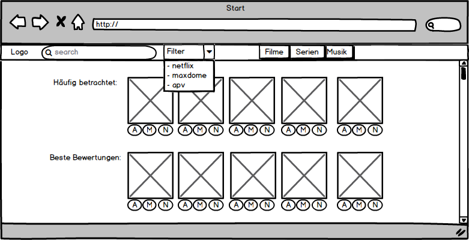
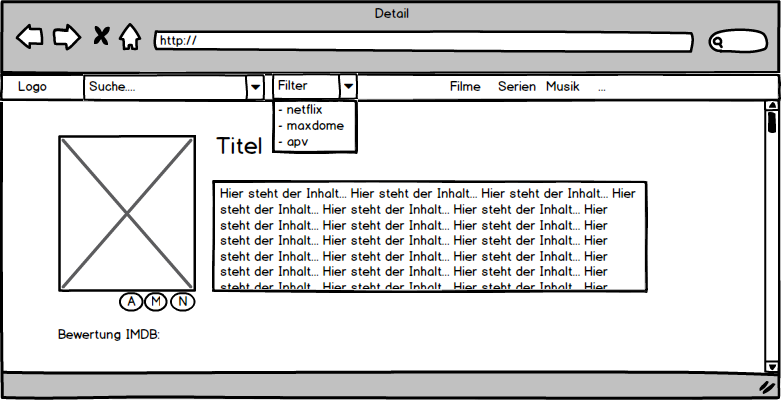

 
## 1. Zielbestimmung
### 1.1       Musskriterien
__Funktional:__
- Anwender kann nach Musik,  Filmen und Serien suchen
- Anwender kann die Suchergebnisse nach Verfügbarkeit auf Streaming Plattformen filtern
- nach Auswahl eines Suchergebnisses wird eine Detailseite zu dem Medium angezeigt
- ist das Medium auf einer Streaming Plattform verfügbar, wird dieses verlinkt
 
__Nicht Funktional:__
- die Startseite zeigt dem Anwender eine Übersicht meist genutzter oder gut bewerteten Medien
- die Verfügbarkeit des Mediums auf den Streaming Plattformen soll immer gut erkennbar sein
- die Detailseite eines Mediums zeigt wichtige Informationen an (Titel, Inhalt, Bewertungen, Cover)

### 1.2       Wunschkriterien
- suche nach eBooks
- Verfügbarkeit / Ansicht auf mobilen Endgeräten
 
### 1.3       Abgrenzungskriterien
Anwender können kein Benutzerkonto anlegen. Website dient nur zur Abfrage und Abgleich von Elementen
von anderen Seiten, nicht zum Austusch über diese (keine eigene Bewertungsfunktion oder individuelle Empfehlungen,
kein eigenes Streaming).

## 2        Produkteinsatz

### 2.1       Anwendungsbereiche
Privat. Suchmaschine um auf schnellen Weg herauszufinden auf welcher Streaming Plattform der Film, das Lied,
die Serie verfügbar ist.

### 2.2       Zielgruppen
Männer und Frauen, Kinder zwischen 8-60 Jahre. Menschen, welche Streaming Plattformen nutzen und kennen.
Soziale Ebene irrelevant

### 2.3       Betriebsbedingungen
Webbrowser
24/7 über Internet erreichbar

## 3        Produktübersicht
 
 Use Case Diagram

## 4        Produktfunktionen
Use Cases

## 5        Produktdaten
- Medium zuletzt aufgerufen um: Zeitstempel
- Anzahl Aufrufe von Medium
- Suchbegriffe
 
## 8        Benutzungsoberfläche

### 8.1 Startseite
 <figure id="Mockup01">
  
</figure>

### 8.2 Suchergebnisse
 <figure id="Mockup02">
  
</figure>

### 8.3 Detail-Ansicht
 <figure id="Mockup03">
  
</figure>
 
## 10    Technische Produktumgebung
 
### 10.1   Software
-  Aktuelle Betriebssysteme – Windows 10, Windows 7, Ubuntu 16.04
-  Welche Webbrowser - Mozilla Firefox v. 49.02, Google Chrome v. 54.0, Opera v. 41.0

 
### 10.2 Verwendete Technologien
Das Projekt wird als SinglePage Anwendung mit Angular.js v2 realisiert. Die Dokumentation 
erfolgt mit Exerslide.
 
## 11    Spezielle Anforderungen an die Entwicklungs-Umgebung
 
### 11.1   Software
- WebStorm IDE
### 11.2   Entwicklungs:Schnittstellen

- Open Movie Database - [OMDb](https://www.omdbapi.com/)
- Spotify - [API](https://developer.spotify.com/web-api/)
- Netflix - [API](https://netflix.github.io/)
- Amazon Product Advertising - [API](https://partnernet.amazon.de/gp/advertising/api/detail/main.html)
- Soundcloud - [API](https://developers.soundcloud.com/docs/api/guide)