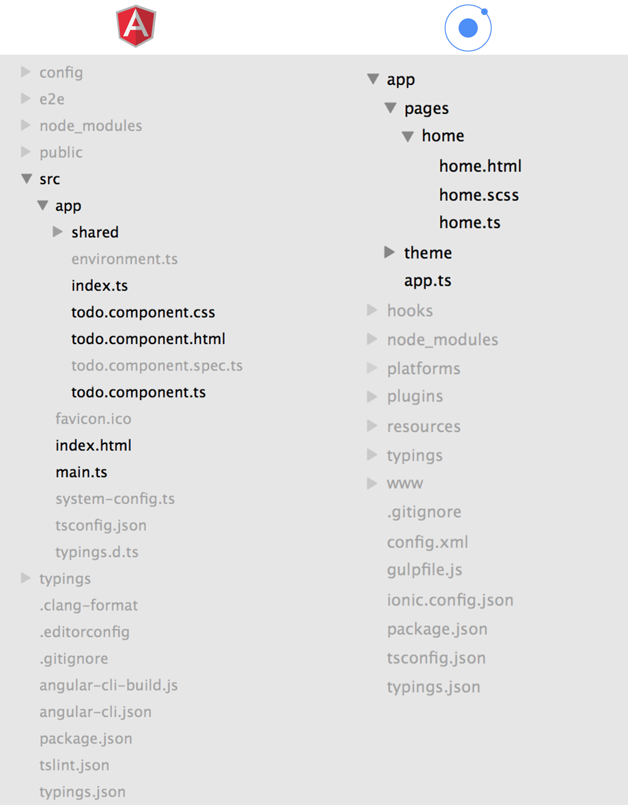

AngularJS und Ionic werden oft in einem Atemzug genannt. Da dies teilweise sehr verwirrend sein
kann, folgt im nachfolgenden eine kurze Erläuterung bezüglich dem Unterschied zwischen diesen
beiden Technologien. 

# Ionic

Ionic bietet zum einen das Standard Ionic OpenSource Framework an. Zum anderen wird zusätzlich
eine Ionic Cloud angeboten, welche zusätzliche Features wie User Authentication, Live App
Deployment und Native App Packaging anbietet.³

## Ionic Framework
Ionic besteht im wesentlichen aus Angular Anwendungen mit zusätzlichen Optionen und
 Möglichkeiten:

## Ionic Aufbau²

- Anwendung
- Ionic
- AngularJS
- WebView (Cordova)
- Native SDK

Ionic baut auf Apache Cordova und AngularJS auf. Somit stellt es Bibliotheken von verschiedenen
Technologien zur Verfügung. Es wurde als Hybrid App entwickelt, sodass es auf verschiedenen
Plattformen genutzt werden kann. AngularJS ist innerhalb von Ionic vor allem für die Struktur
zuständig, während Ionic selbst mehr die Benutzeroberfläche realisiert.⁴

## Ionic Verwendung

Ionic kann entweder über ein CLI Tool verwaltet und konfiguriert werden oder man verwendet den 
Ionic Creator. Ionic Creator ist ein Drag & Drop Entwicklertool zum erstellen von Apps.³

# AngularJS vs. Ionic

## Struktur

 <figure id="StructureAngJSIo">
  
</figure>
⁵

In der Abbildung ist ein Vergleich von dem Inhalt eines Start AngularJS- und eines Start Ionic Projektordner
zu sehen. Die fett angezeigten Dateien und Ordner markieren die am meisten Interessanten
Unterschiede. Bei Ionic werden die einzelnen Pages in einem eigenen Ordner unter "pages" abgelegt.
Bei AngularJS hingegen, sind alle Seiten standardmäßig im Ordner App untergebracht. Abgesehen
dieser Tatsache ähnelt sich die Struktur. Es gibt für jede Seite eine .html, .(s)css und .ts Datei und für die 
gesamte App gibt es eine Haupt-TypeScript Datei (main.ts - app.ts). 

## Komponenten

AngularJS

```
import {Component} from '@angular/core';
 
@Component({
  moduleId: module.id,
  selector: 'todo-app',
  templateUrl: 'todo.component.html',
  styleUrls: ['todo.component.css']
})
export class TodoAppComponent {
  title = 'todo works!';
}
```

Ionic

```
import {Component} from '@angular/core';
 
@Component({
  templateUrl: 'todo.component.html'
})
export class TodoAppComponent {
  constructor() {
 
  }
}
```

Die Komponenten ähneln sich sehr stark bis auf den Unterschied, dass bei Angular auf einen Selector
verwiesen wird, welcher in Ionic nicht benötigt wird, da innerhalb Ionic mit einem so genannten Nav
Controller zwischen den Seiten gewechselt wird. Ebenso wird die moduleID nur zum rekonstruieren
der Pfade für Angular und nicht für Ionic benötigt.

## Main.ts - App.ts

Angular - Main.ts
```
import './polyfills.ts';

import { platformBrowserDynamic } from '@angular/platform-browser-dynamic';
import { enableProdMode } from '@angular/core';
import { environment } from './environments/environment';
import { AppModule } from './app/';

if (environment.production) {
  enableProdMode();
}

platformBrowserDynamic().bootstrapModule(AppModule);
```

Ionic - App.ts
```
import { platformBrowserDynamic } from '@angular/platform-browser-dynamic';

import { AppModule } from './app.module';

platformBrowserDynamic().bootstrapModule(AppModule);
```

Vergleicht man die beiden Hauptdateien der Projekte miteinander, sind so gut wie keine Unterschiede
mehr feststellbar. Beide Projekte werden mit dem BootstrapModule geladen, welches bewirkt, dass
die Anwendung mit einer Root-Komponente instantiiert wird. In einer älteren Version von Ionic war
dies noch nicht der Fall. Hier wurde zur Instantiierung ein spezieller Bezeichner namens "@App" 
verwendet.

Diese und weitere Vergleiche sind auf folgender Seite aufgeführt: [Using Angular 2 without Ionic 2](http://www.joshmorony.com/using-angular-2-without-ionic-2-part-1/)

# Quellen

1. Difference Ionic AngularJS - http://www.joshmorony.com/whats-the-difference-between-ionic-and-angularjs/
2. Angular Presentation - http://ionicframework.com/present-ionic/slides/#/26
3. Ionic.io - https://ionic.io/discover
4. Wikipedia Ionic - https://de.wikipedia.org/wiki/Ionic_(Framework)
5. Bild: Angular vs Ionic - http://www.joshmorony.com/wp-content/uploads/2016/06/angularvsionic.png
6. Using Angular 2 without Ionic 2 - http://www.joshmorony.com/using-angular-2-without-ionic-2-part-1/