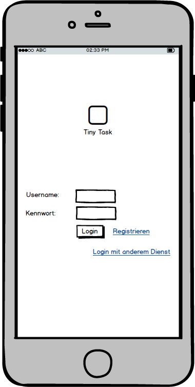
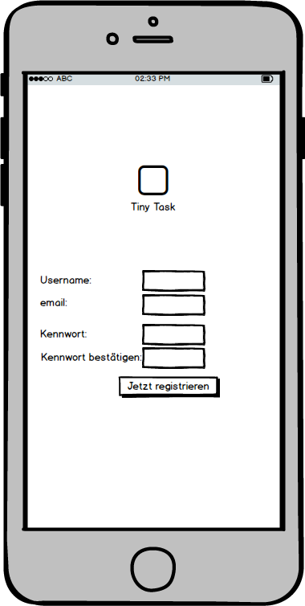
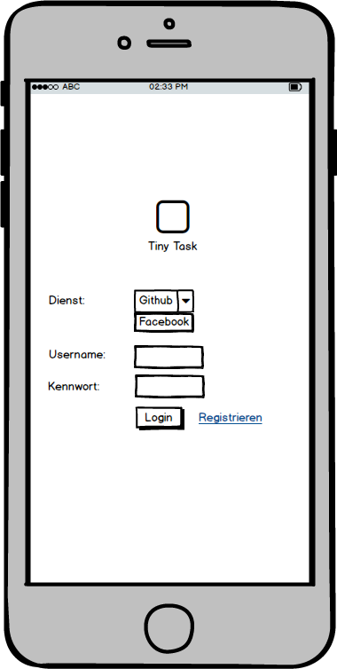
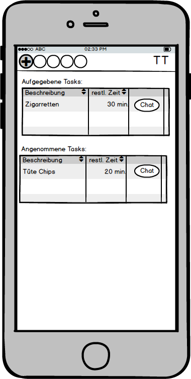
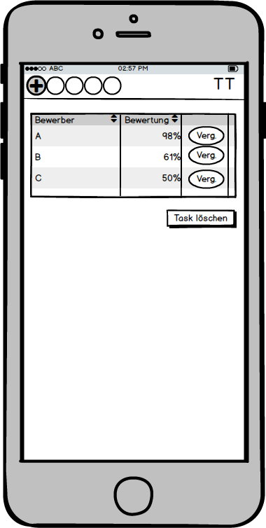
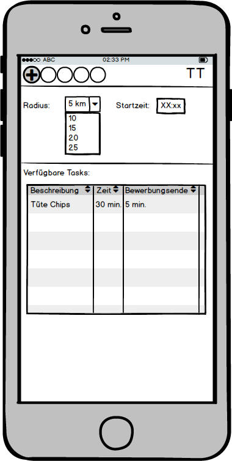
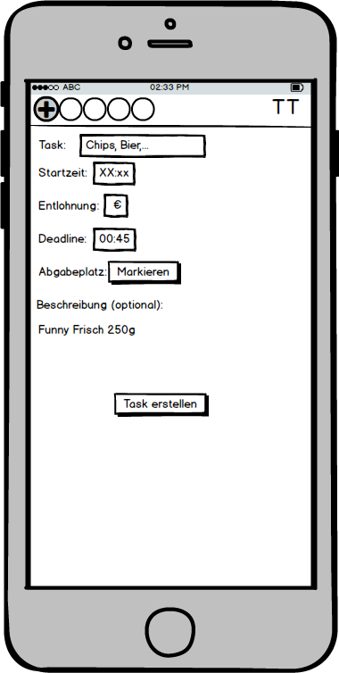
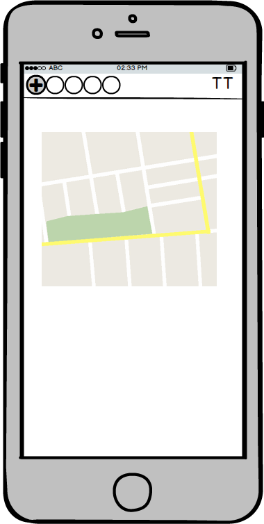
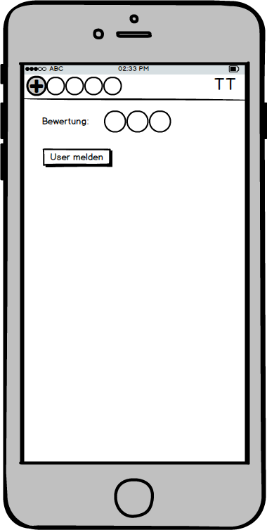

# 1\. Login

<figure id="login">
  
</figure>

# 2\. Login Registrieren

<figure id="login_reg">
  
</figure>

# 3\. Login Dienst

<figure id="login_alt">
  
</figure>

# 4\. Start

<figure id="start">
  
</figure>

# 5\. Bewerber aussuchen

<figure id="bewerb_suchen">
  
</figure>

# 6\. Suchen

<figure id="suchen">
  
</figure>

# 7\. Erstellen

<figure id="erstellen">
  
</figure>

# 8\. Taskansicht Angenommen

<figure id="taskansicht_angenommen">
  
</figure>

# 9\. Taskansicht Auftragnehmer

<figure id="taskansicht_AN">
  
</figure>

# 10\. Profil

<figure id="profil">
  
</figure>

# 11\. Map

<figure id="map">
  
</figure>

# 12\. Taskende

<figure id="taskende">
  
</figure>

# 12\. Chat

<figure id="chat">
  
</figure>
