---
title: Deployment Heroku
chapter: TinyTask
---
## Heroku
Heroku ist ein sogenanntes *Platform as a Service* (PaaS), welches dem Entwickler erlaubt, seine Software zu entwickeln, auszuführen und managen ohne sich um den damit verbundenen großen administrativen Aufwand, der zum Deployment der Applikation nötig ist, zu kümmern.

## Registrierung
Zur Registrierung auf der Heroku-Platform klicken Sie [hier](https://signup.heroku.com/).

Das Registrierungsformular ist in der folgenden Abbildung zu sehen.

## Anmeldung
Nach der Registrierung folgt die [Anmeldung](https://id.heroku.com/login).

## Zahlungsinformationen hinterlegen
Um MongoDB zu deployen, müssen Zahlungsinformationen hinterlegt werden. Grund hierfür ist, dass mLab MongoDB nur als Plugin zur Verfügung gestellt wird.
Heroku akzeptiert als Zahlungsmethode lediglich Kreditkarten.

Für das Hinterlagen der Zahlungsinformationen klicken Sie auf das Benutzerlogo in der oberen rechten Ecke und wählen Sie *Account settings*, wie der Abbildung zu entnehmen ist.
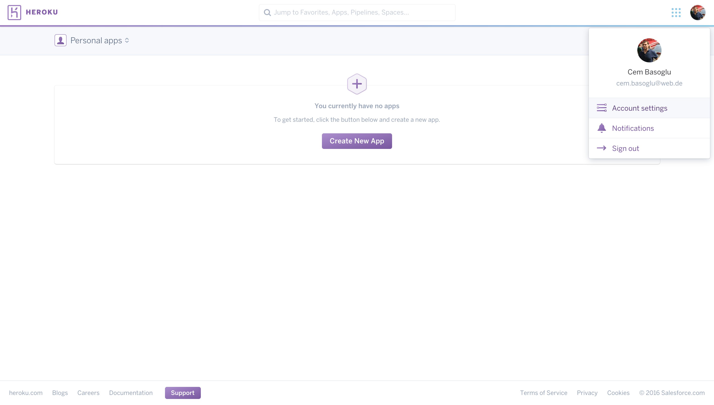

  
Im nächsten Schritt wechseln Sie auf den Tab *Billing* und klicken auf den Button *Add Credit Card*
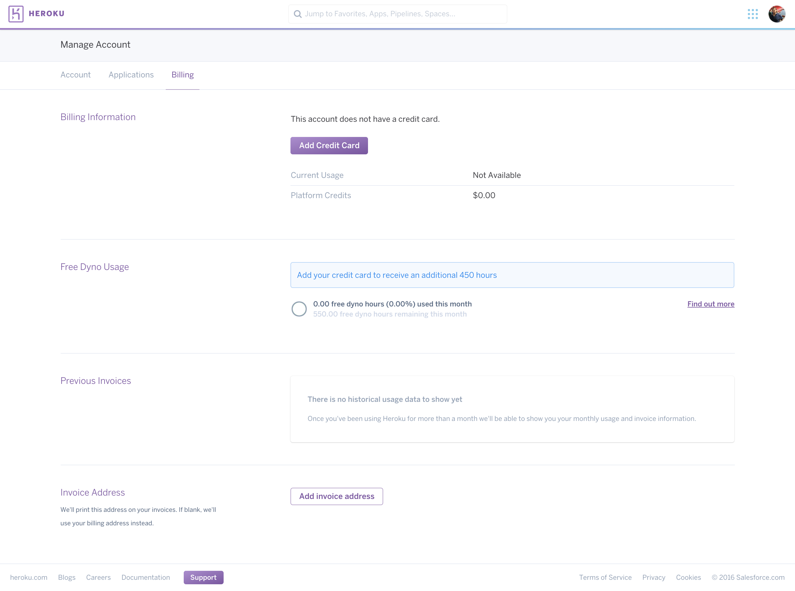

  
Anschließend sind die Zahlungsdaten auszufüllen und mit Klick auf *Save Details* zu bestätigen.

  
Nach erfolgreichem Hinterlegen der Kreditkarte, sind die letzten vier Ziffern der Kreditkarte zu erkennen. Die Zahlungsinformationen können jederzeit durch Klicken auf  *Update Credit Card* aktualisiert werden.
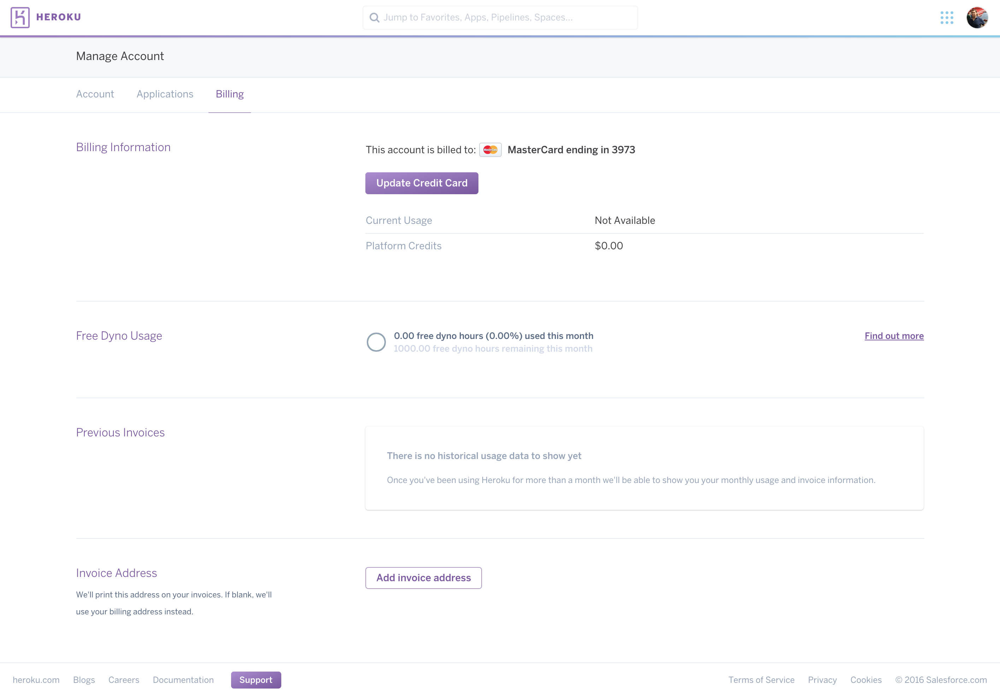

## Applikation erstellen
Das Erstellen einer Applikation kann auf dem [Dashboard](https://dashboard.heroku.com/apps) der Heroku-Platform durchgeführt werden.
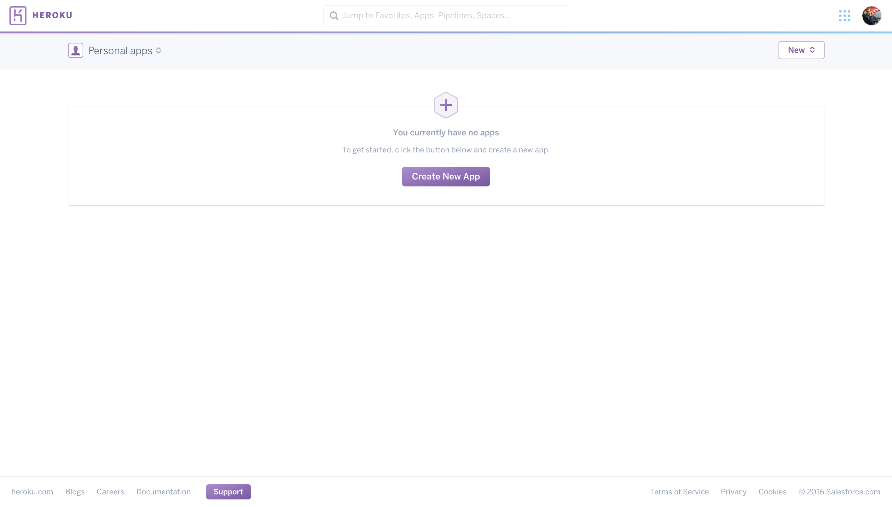

  
Mit Öffnen des Dashboards und anschließendem Drücken des Button *Create new App*, können der Applikationsname und dessen Ausführungsregion eingestellt werden. Der Button *Create App* erstellt lediglich die Applikation, d.h. die Datenbank muss noch hinzugefügt werden.
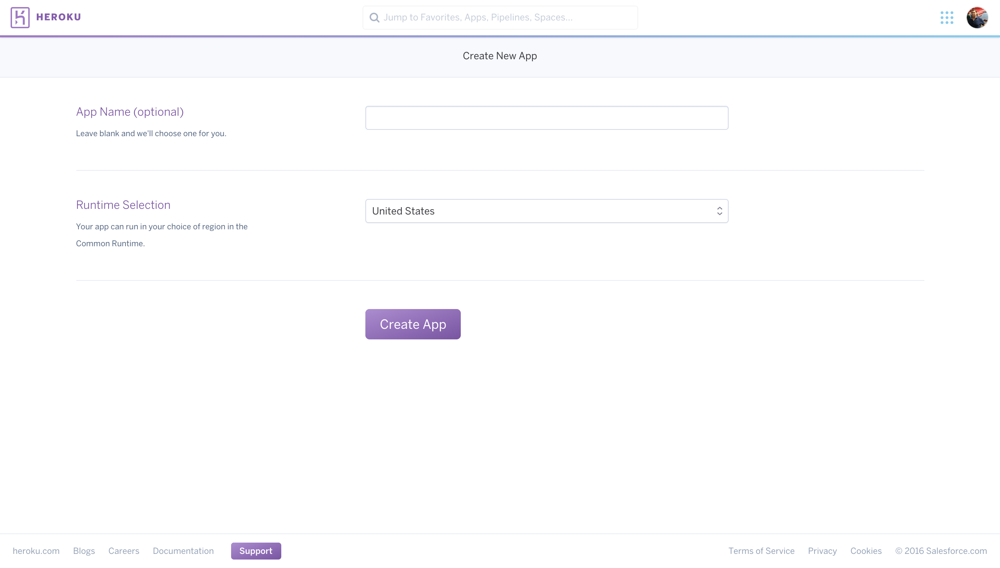

## MongoDB zur Applikation hinzufügen
Nachdem die Applikation erstellt wurde, wird sie im Dashboard aufgelistet. Durch Auswählen der Applikation kann eine Datenbank hinzugefügt werden, die auch für andere Applikationen verwendet werden kann.

Unter dem Tab *Resources* kann unter dem Punkt *Add-ons* nach einem Add-on gesucht werden, welches anschließend der Applikation im Backend zur Verfügung steht.

Suchen Sie nach "mLab MongoDB" in der Suche und wählen dieses Add-on aus, wie dem folgenden Bild zu entnehmen ist.  
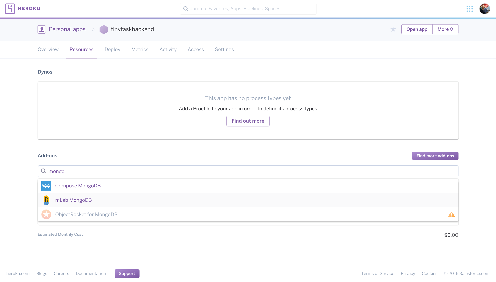

  
Je nach Datenverbrauch der Applikation kann im nächsten Fenster ein Angebot auswählt werden. Für wenig Daten reicht das *Sandbox - Free*-Angebot. Bestätigen Sie Ihre Wahl durch Drücken des Buttons *Provision*.
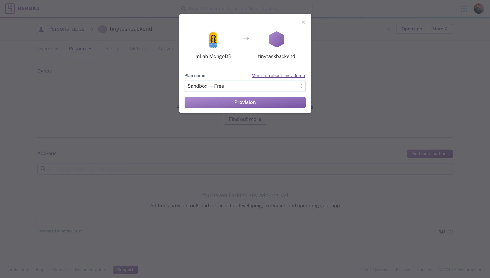

  
Nach erfolgreichem Hinzufügen der Datenbank, erscheint folgendes Fenster:

  
Da die Datenbank noch leer ist, kann durch Klick auf *mLab MongoDB::MongoDB* im Punkt *Add-ons* auf die Datenbank (Collections, Benutzer usw.) aus dem Browser heraus zugegriffen werden.
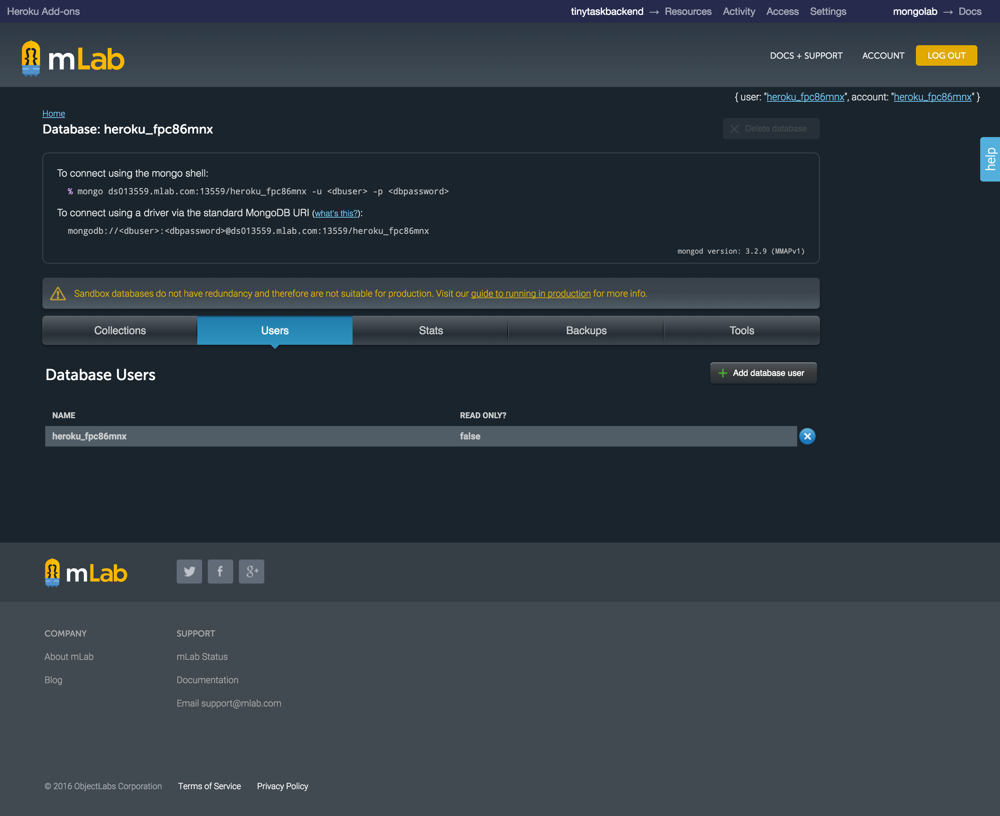

  
Wenn noch kein Benutzer in der Datenbank angelegt wurde, sollte an dieser Stelle einer angelegt werden. Dies kann durch Klicken auf *Add database user* erreicht werden. Ein Formular wird angezeigt, indem ein Benutzname und ein Passwort festgelegt werden. Mit Klicken auf *Create* wird der Benutzer in der Datenbanl angelegt.
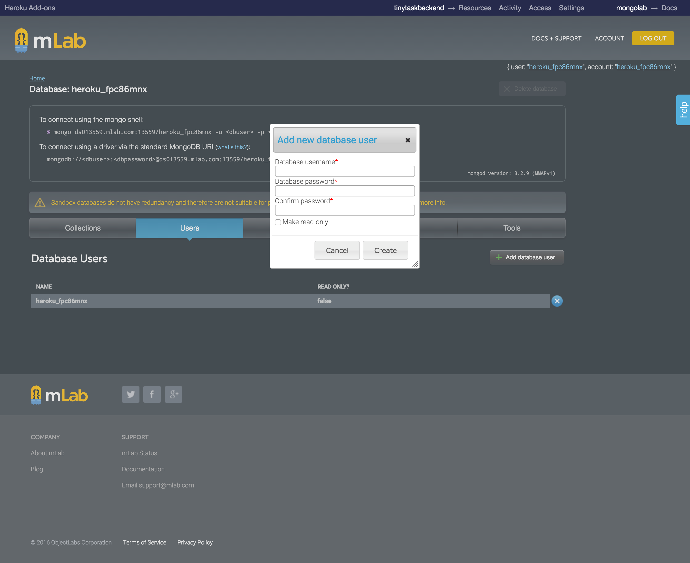

## Deployment Quelle angeben
Im nächsten Schritt wird festgelegt, über welche der zur Verfügung gestellten Methoden deployt wird. Dabei stehen Heroku Git, GitHub und Dropbox als Quellen zur Wahl.

Um die Deployment-Medthode festzulegen, wählen Sie im Dashboard Ihre Applikation aus und wechseln in den Tab *Deploy*. Unter *Deployment method* wählen Sie Ihre Quelle aus.

In dieser Anleitung wurde dies beispielhaft mit GitHub als Quelle durchgeführt.   
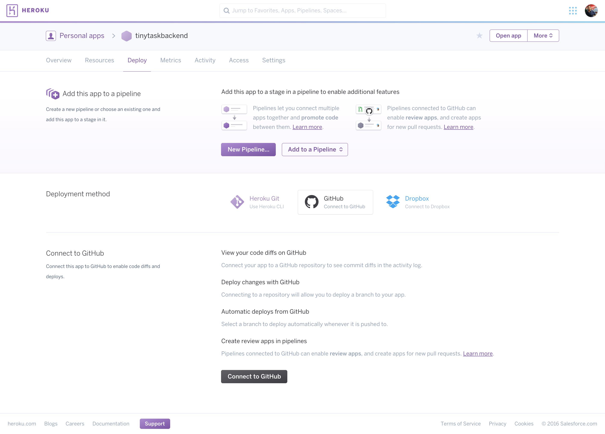

  
Nachdem GitHub als Quelle ausgewählt wurde, erscheint ein Fenster zur Authorisierung des Zugriffs von Heroku auf das GitHub-Konto. Durch Klicken auf *Authorize application* wird der Zugriff bestätigt.

  
Unter dem Punkt *Connect to GitHub* kann das zu deployende Repository gesucht und ausgewählt werden.
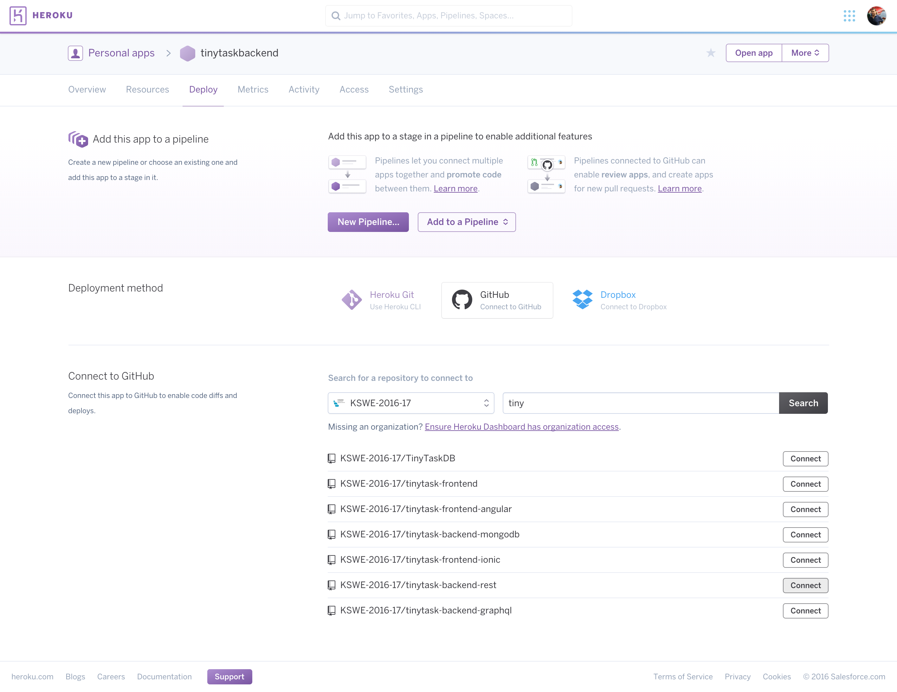

  
Anschließend kann der Branch ausgewählt werden. Zudem besteht die Möglichkeit, automatisches Deployment zu aktivieren. Der Button *Enable Automatic Deploys* aktiviert das Deployment. Alternativ kann auch manuell deployt werden. Diese Option ist unter dem Punkt *Manual deploy* zu finden.

  
Wenn das automaitsche Deployment erfolgreich aktiviert wurde, sieht das Fenster wie folgt aus:
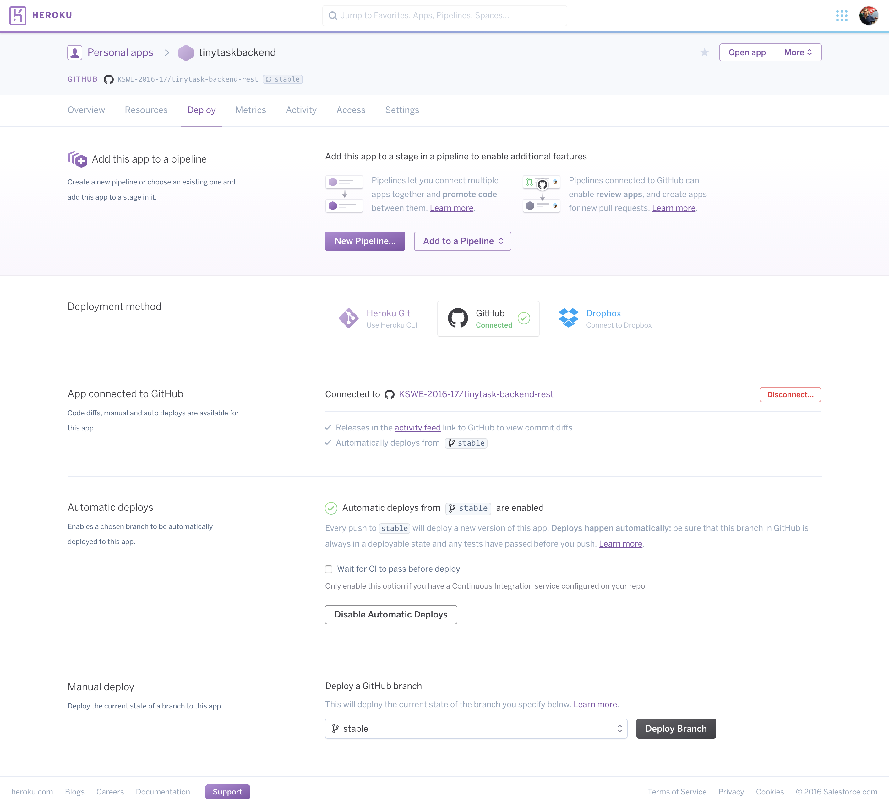

## Konfigurationsparameter der Applikation
In der Applikationen müssen noch einige Einstellungen vorgenommen werden. So muss die Variable konfiguriert werden, um sich mit der Datenbank zu verbinden.
Dies kann auf der Heroku-Platform in der Applikation unter dem Tab *Settings* im Punkt *Config Variables* eingestellt werden.

  
Die Variablen haben jedoch ein bestimmtes Schema. Das Schema der Konfigurationsvariable sieht wie folgt aus:

Key: MONGO_DB

Value: mongodb://<dbuser>:<dbpass>@ds013559.mlab.com:13559/heroku_fpc86mnx

Das Schema ist auch der folgenden Abbildung zu entnehmen.

## Applikation öffnen
Zum Starten der Applikation klicken Sie auf der Heroku-Platform in der rechten oberen Ecke auf den Button *Open App*. Dadurch öffnet sich ein neues Browser-Fenster, das den Benutzer zur URL der Applikation führt.

