## Hauptansicht Fahrer 
 <figure id="Mockup01">
  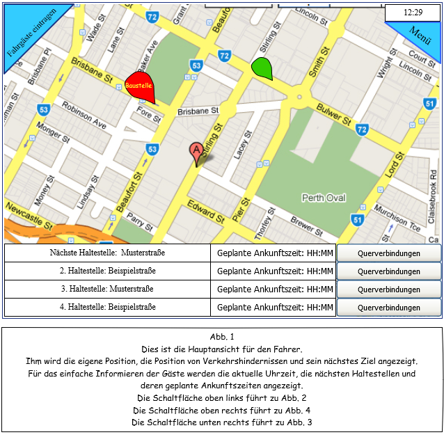
  </figure>

## Zu-/Austiege Fahrer
 <figure id="Mockup02">
 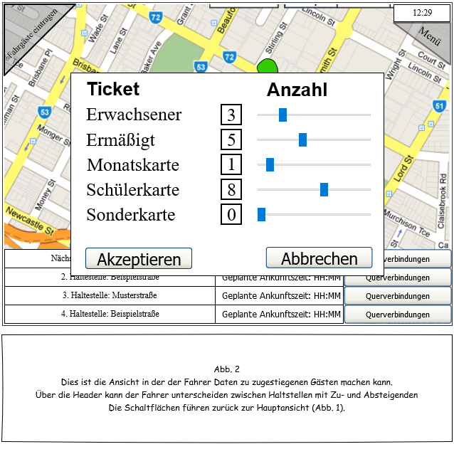
 </figure>

## Anzeige Anschlüsse Fahrer
 <figure id="Mockup03">
 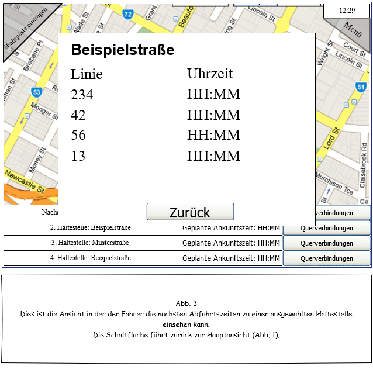
 </figure>

## Hauptmenü Fahrer
 <figure id="Mockup04">
 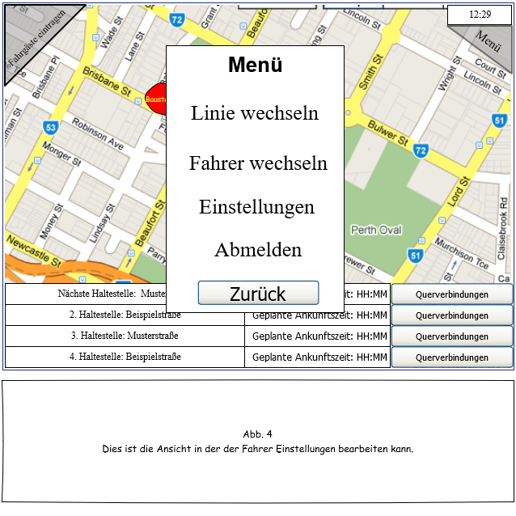
 </figure>

## Übersicht Zentrale
 <figure id="Mockup05">
 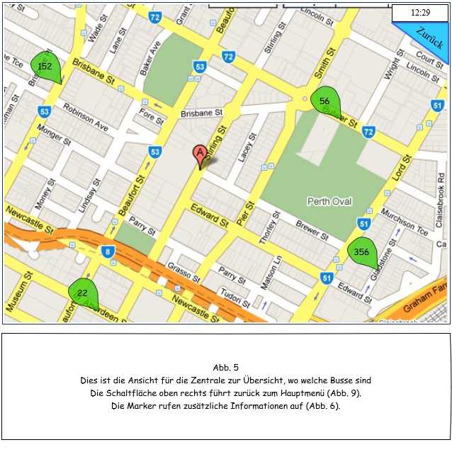
 </figure>

## Tooltips in Übersicht für Zentrale
<figure id="Mockup06">
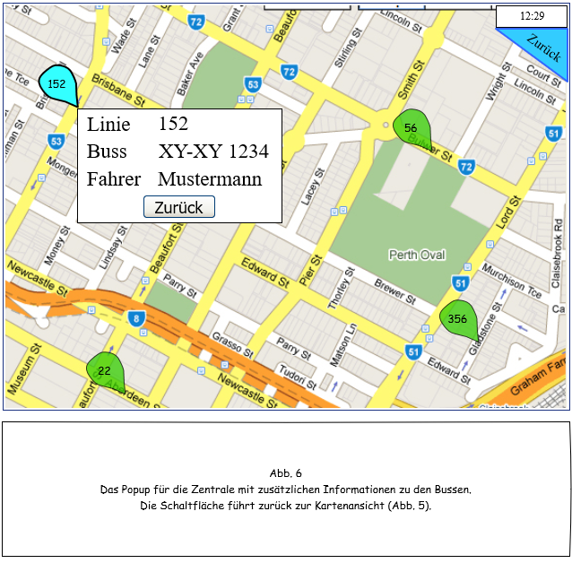
</figure>

## Linienverwaltung Zentrale
<figure id="Mockup07">
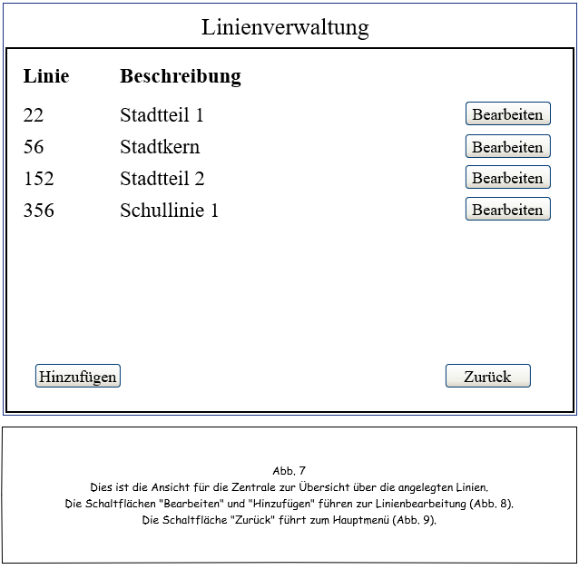
</figure>

## Details zu Line Zentrale
<figure id="Mockup08">
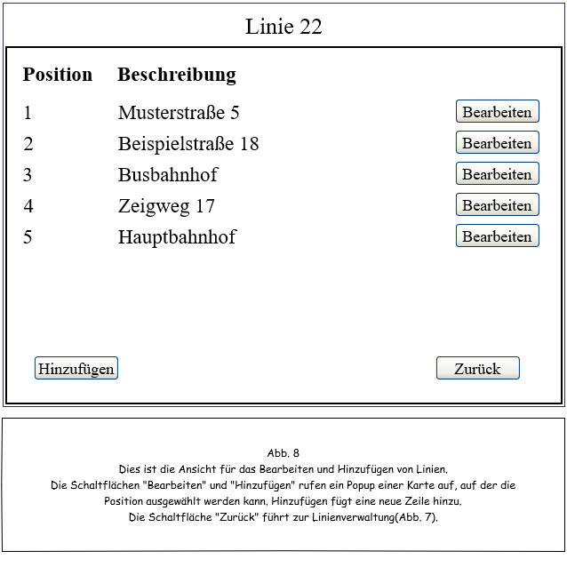
</figure>

## Zentrale Hauptmenü
<figure id="Mockup09">
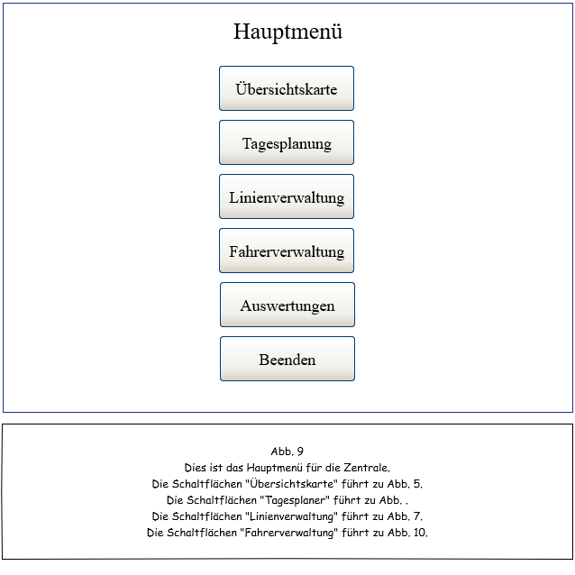
</figure>

## Fahrerverwaltung Zentrale
<figure id="Mockup10">
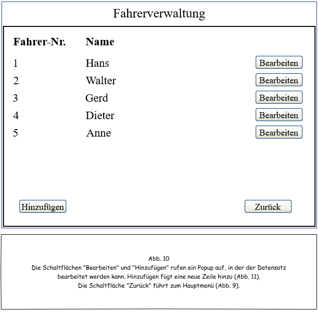
</figure>

## Details Fahrer Zentrale
<figure id="Mockup11">
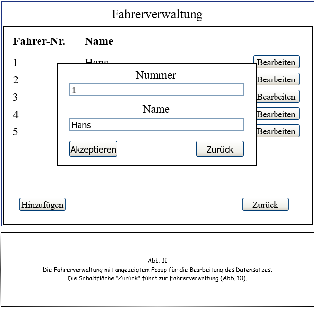
</figure>

## Tagesplanung Zentrale
<figure id="Mockup12">
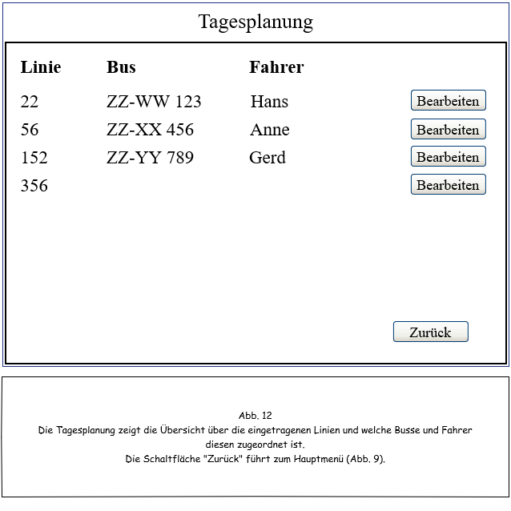
</figure>
