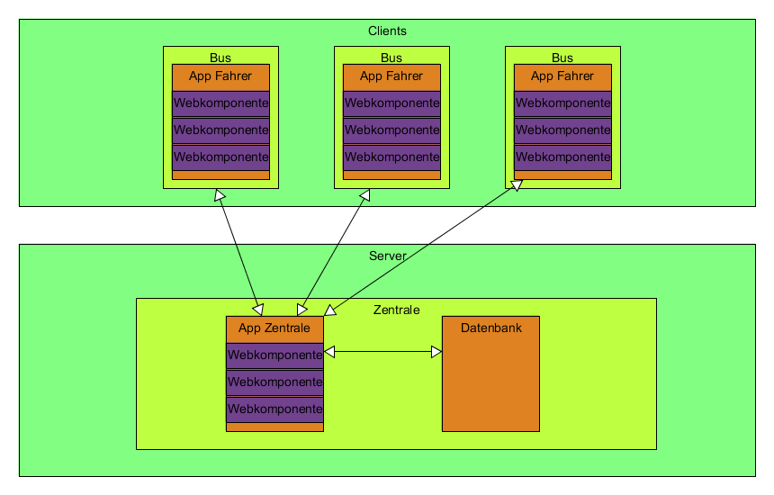

## Anforderungsanalyse
Das Ziel des Projekts ist es Busfahrern schnell und übersichtlich Informationen anzuzeigen. Daher ist das Hauptaugenmerk auf der Darstellung dieser in einer intuitiven Ansicht, die möglichst wenig Manipulation und Eingaben des Fahrers benötigt. Die niedrige Nutzerinteraktion ist wichtig, da ein Fahrer keine Möglichkeit dazu hat während der Fahrt. Dazu bedienen wir uns des bestehenden und geprüften Modells des Navigationssystems ohne die Wegfindung.

#### Muss-Kriterien
- Dem Fahrer wird eine seiner Umgebung angezeigt
- Dem Fahrer wird die nächste Station auf der Karte angezeigt angezeigt
- Dem Fahrer werden die möglichen Anschlüsse für Haltestellen angezeigt
- Dem Fahrer werden durch die Zentrale eingegebene Verkehrshindernisse auf der Karte angezeigt
- Die Zentrale kann Linien verwalten (erstellen, bearbeiten, löschen, zuordnen)
- Die Zentrale kann Fahrzeuge (Busse) verwalten (erstellen, bearbeiten, löschen, zuordnen)
- Die Zentrale kann Fahrer verwalten (erstellen, bearbeiten, löschen, zuordnen)
- Die Zentrale kann Verkehrshindernisse verwalten (erstellen, bearbeiten, löschen, zuordnen)

#### Kann-Kriterien
- Der Fahrer kann für die Statistik auf Haltestellen bezogene Daten zu zu- und aussteigenden Gästen eintragen
- Dem Fahrer können Push-Nachrichten von der Zentrale zugestellt werden
- Die Zentrale kann Push-Nachrichten an die Fahrer senden
- Der Zentrale werden Statistiken angezeigt

#### Abgrenzungs-Kriterien
- Keine Chatmöglichkeit für Fahrer untereinander oder mit der Zentrale
- Kein handhaben von Ticketverkäufen

## Produkteinsatz
#### Anwendungsbereiche
Das Produkt wird im privaten Bereich genutzt.

#### Zielgruppe
Das Produkt ist gedacht für den kommerziellen Gebrauch durch Betriebe, die im öffentlichen Nahverkehr tätig sind. 

#### Betriebsbedingungen
Das Produkt benötigt eine Client-Server Architektur. Die Applikation für die Zentrale stellt den Server zur Verfügung für die Clients der Fahrer zum Verbinden.

## Softwarearchitektur
<figure id="swarchitektur">

</figure>
