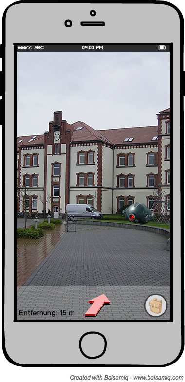
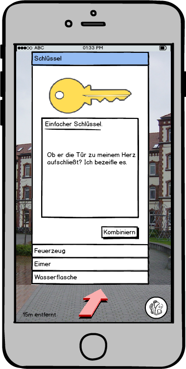

## User-Stories

* Ich als Nutzer möchte mit einem kleinen Intro eingeführt werden so dass ich alle Interaktion Möglichkeiten kennenlerne
* Ich als Nutzer möchte Gegenstände in mein Inventar aufnehmen so dass ich diese im Laufe des Spiel verwenden kann
* Ich als Nutzer möchte mein Inventar einsehen können so dass ich sehen kann welche Gegenstände ich bereits aufgenommen habe
* Ich als Nutzer möchte Gegenstände in meinem Inventar kombinieren können so dass ich neue Gegenstände erhalte
* Ich als Nutzer möchte Gegenstände in meinem Inventar nutzen können so dass ich mit der AR Welt interagieren kann
* Ich als Nutzer möchte AR Elemente anklicken können, so dass ich eine Beschreibung erhalte
* Ich als Nutzer möchte das die Storyelement passend geladen werden, so dass ein linearer Spielverlauf möglich ist
* Ich als Nutzer möchte das beim scannen verschiedener realer Objekte ein virtuelles Objekt erscheint, so dass weiter Information erhalte.
* Ich als Nutzer möchte das mir auf Knopfdruck geholfen wird falls ich stecken geblieben bin, so dass ich das Spiel weiter spielen kann.

## Use-Case-Diagramm

### Gesamtsystem

### Inventar

## Mockups

### Begrüßungsbildschirm

### Hauptansicht

### Inventar

### Items kombinieren
![Item combining] (./images/mockups/ItemCombining.png "Item combining")

### Item kombinert
![Item combined] (./images/mockups/ItemCombined.png "Item combined")